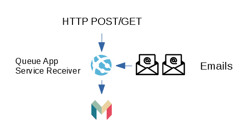

# Monzo Email Integration .NET Core

This combines Monzo with an Email Parser that's listening the inbox of an outlook email account. When it finds a matching email, it will find a match with a recent transaction and updates accordingly. 

In this example, I'm checking for an order confirmed email from ebay and finds the name of the item, the price and the thumbnail, it then updates the monzo tranaction notes and looks for a transaction labeled "#ebay" and updated it with the name of the item and well as attaching the thumbnail as an image.

